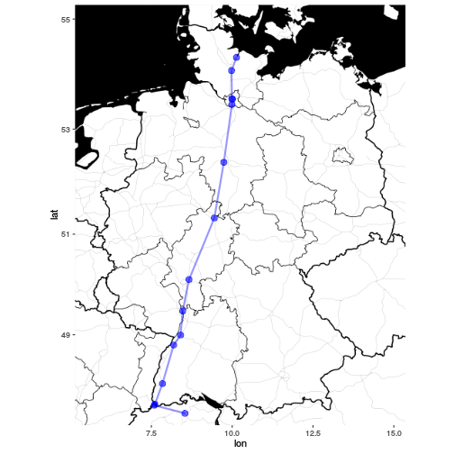

## DBopen - Query the DB-Open-Data timetable API

In 2015 *Deutsche Bahn*, the German state-owned railway company, started an [Open-Data project](http://data.deutschebahn.com/) including access to their [timetable API](http://data.deutschebahn.com/apis/fahrplan/). At the moment this service is available for long-distance traffic only. This package provides some functionality to fetch data from the timetable API easily.

Please be aware that an authentication key is required to work with `DBopen`[^1]. The team of DB-Open-Date issues API keys to anyone sending an E-Mail to [dbopendata@deutschebahn.com](mailto:dbopendata@deutschebahn.com).

### Get the API specific station ID

Every train station has a unique API specific ID that is used to identify the station in API queries. `getStopID()` can be used to get the ID of the station that best matches the character pattern `station`. To look up the `stopID` for Hamburg Main Station using the German expression *Hamburg Hbf* where *Hbf* is the clipped form of *Hauptbahnhof* (`<Ger.>` *Main Station*):


```r
library(DBopen)
getStopID(station = "Hamburg Hbf", authKey = authKey)
```

```
##          name        id
## 1 Hamburg Hbf 008002549
```

For further processing the `stopID` gets stored:


```r
stopID <- getStopID(station = "Hamburg Hbf", authKey = authKey)$id
```

### Fetch departure and arrival boards

With the just fetched `stopID` one can continue and fetch departure and arrival boards. Both functions, `departureBoard()` and `arrivalBoard()`, require identical input:

* a `stopID` identifying a station
* a `date` for which the data shall be fetched
* a `time` of day which the data shall be fetched
* the API authentication key `authKey` and
* a logical value (`refs`) indicating whether additional train specific information shall be fetched


```r
departureBoard(stopID = stopID, date = "2016-09-01", time = "08:00", authKey = authKey)
```

```
##          Date        From                 To  Time    Train Track
## 1  2016-09-01 Hamburg Hbf          Zürich HB 08:02   ICE 73    14
## 2  2016-09-01 Hamburg Hbf       Hannover Hbf 08:24  IC 2087    11
## 3  2016-09-01 Hamburg Hbf        München Hbf 08:28 ICE 1145    14
## 4  2016-09-01 Hamburg Hbf        München Hbf 08:36 ICE 1589     7
## 5  2016-09-01 Hamburg Hbf      Stuttgart Hbf 08:45  IC 2313    14
## 6  2016-09-01 Hamburg Hbf        Praha hl.n. 08:51   EC 379     8
## 7  2016-09-01 Hamburg Hbf      Stuttgart Hbf 09:01  ICE 575    14
## 8  2016-09-01 Hamburg Hbf   Westerland(Sylt) 09:16  IC 2314    12
## 9  2016-09-01 Hamburg Hbf       Koebenhavn H 09:28   ICE 33  7E-I
## 10 2016-09-01 Hamburg Hbf        München Hbf 09:29  ICE 787    14
## 11 2016-09-01 Hamburg Hbf    Berlin Südkreuz 09:38  IC 1109     7
## 12 2016-09-01 Hamburg Hbf      Stralsund Hbf 09:44  IC 2182     8
## 13 2016-09-01 Hamburg Hbf Frankfurt(Main)Hbf 09:46 ICE 1025    14
## 14 2016-09-01 Hamburg Hbf               Chur 10:01   ICE 75    14
## 15 2016-09-01 Hamburg Hbf           Kiel Hbf 10:16  IC 2224    12
## 16 2016-09-01 Hamburg Hbf        München Hbf 10:28  ICE 587    14
## 17 2016-09-01 Hamburg Hbf      Innsbruck Hbf 10:36 ICE 1209     8
## 18 2016-09-01 Hamburg Hbf      Stuttgart Hbf 10:46  IC 2217    11
## 19 2016-09-01 Hamburg Hbf      Fredericia st 10:53   IC 386  6D-E
## 20 2016-09-01 Hamburg Hbf      Stuttgart Hbf 11:01  ICE 577    14
```

```r
arrivalBoard(stopID = stopID, date = "2016-09-01", time = "18:00", authKey = authKey)
```

```
##          Date        Stop    Train               From  Time Track
## 1  2016-09-01 Hamburg Hbf   IC 385      Fredericia st 18:03 11D-F
## 2  2016-09-01 Hamburg Hbf  IC 2024         Passau Hbf 18:13    14
## 3  2016-09-01 Hamburg Hbf  IC 2289      Stralsund Hbf 18:15    12
## 4  2016-09-01 Hamburg Hbf  ICE 802  Berlin Hbf (tief) 18:21     8
## 5  2016-09-01 Hamburg Hbf  EC 1238      Oesterport st 18:22     6
## 6  2016-09-01 Hamburg Hbf  ICE 788        München Hbf 18:28     8
## 7  2016-09-01 Hamburg Hbf  IC 2082  Berchtesgaden Hbf 18:35    14
## 8  2016-09-01 Hamburg Hbf  IC 2073   Westerland(Sylt) 18:48     7
## 9  2016-09-01 Hamburg Hbf  ICE 576      Stuttgart Hbf 18:53    12
## 10 2016-09-01 Hamburg Hbf   EC 378        Praha hl.n. 19:11     7
## 11 2016-09-01 Hamburg Hbf  IC 2312      Stuttgart Hbf 19:13    12
## 12 2016-09-01 Hamburg Hbf ICE 1588        München Hbf 19:24     7
## 13 2016-09-01 Hamburg Hbf ICE 1156        München Hbf 19:28    12
## 14 2016-09-01 Hamburg Hbf  IC 2280       Hannover Hbf 19:35     8
## 15 2016-09-01 Hamburg Hbf  IC 2225           Kiel Hbf 19:42    14
## 16 2016-09-01 Hamburg Hbf  IC 2196           Köln Hbf 19:46    11
## 17 2016-09-01 Hamburg Hbf   ICE 72               Chur 19:53    14
## 18 2016-09-01 Hamburg Hbf ICE 1026 Frankfurt(Main)Hbf 20:13    11
## 19 2016-09-01 Hamburg Hbf  ICE 706    Berlin Südkreuz 20:21     7
## 20 2016-09-01 Hamburg Hbf   ICE 32      Oesterport st 20:21  5D-E
```

When setting `refs = FALSE` (as is per default) `departureBoard()` and `arrivalBoard()` both return a `data.frame`. With setting `refs = TRUE` this behaviour changes: Both functions then return a list containing 

* the departure or arrival board in `$departureBoard` or `$arrivalBoard`
* a second `data.frame` containing a train specific reference URL for a further API call.

This second `data.frame` can be found in `$departureBoardRef` or `$arrivalBoardRef` depending on which function you use. For the above departure board `$departureBoardRef` looks like follows:


```r
dep <- departureBoard(stopID = stopID, 
                      date = "2016-09-01", 
                      time = "08:00", 
                      authKey = authKey, 
                      refs = TRUE)
```


```r
dep$departureBoardRef
```

```
##          Date  Time    Train Ref
## 1  2016-09-01 08:02   ICE 73 ...
## 2  2016-09-01 08:24  IC 2087 ...
## 3  2016-09-01 08:28 ICE 1145 ...
## 4  2016-09-01 08:36 ICE 1589 ...
## 5  2016-09-01 08:45  IC 2313 ...
## 6  2016-09-01 08:51   EC 379 ...
## 7  2016-09-01 09:01  ICE 575 ...
## 8  2016-09-01 09:16  IC 2314 ...
## 9  2016-09-01 09:28   ICE 33 ...
## 10 2016-09-01 09:29  ICE 787 ...
## 11 2016-09-01 09:38  IC 1109 ...
## 12 2016-09-01 09:44  IC 2182 ...
## 13 2016-09-01 09:46 ICE 1025 ...
## 14 2016-09-01 10:01   ICE 75 ...
## 15 2016-09-01 10:16  IC 2224 ...
## 16 2016-09-01 10:28  ICE 587 ...
## 17 2016-09-01 10:36 ICE 1209 ...
## 18 2016-09-01 10:46  IC 2217 ...
## 19 2016-09-01 10:53   IC 386 ...
## 20 2016-09-01 11:01  ICE 577 ...
```

I have to suppress the actual output for column `Ref` because the API authentication key is visible in the URLs.

### Get further details on a specific train

The reference URLs available in `$departureBoardRef$Ref` or `$arrivalBoardRef$Ref` can now be used to get additional information on a certain train like 

* all stops on a train's journey,
* coordinates and succession of these stations and
* arrival and departure times for each station.


```r
url <- dep$departureBoardRef$Ref[1]
journeyDetails(ref = url)
```

```
##                      name      id       lon      lat routeIdx arrTime
## 1                Kiel Hbf 8000199 10.131975 54.31498        0    <NA>
## 2              Neumünster 8000271  9.979815 54.07575        1   07:00
## 3         Hamburg Dammtor 8002548  9.989568 53.56075        2   07:53
## 4             Hamburg Hbf 8002549 10.006908 53.55273        3   07:59
## 5         Hamburg-Harburg 8000147  9.991698 53.45591        4   08:11
## 6            Hannover Hbf 8000152  9.741016 52.37676        5   09:23
## 7     Kassel-Wilhelmshöhe 8003200  9.446898 51.31312        6   10:36
## 8      Frankfurt(Main)Hbf 8000105  8.663785 50.10715        7   12:00
## 9            Mannheim Hbf 8000244  8.468917 49.47935        8   12:43
## 10          Karlsruhe Hbf 8000191  8.402181 48.99351        9   13:08
## 11            Baden-Baden 8000774  8.190827 48.79033       10   13:25
## 12 Freiburg(Breisgau) Hbf 8000107  7.841173 47.99770       11   14:10
## 13           Basel Bad Bf 8000026  7.607804 47.56729       12   14:45
## 14              Basel SBB 8500010  7.589169 47.54707       13   14:54
## 15              Zürich HB 8503000  8.539203 47.37819       14   16:00
##       arrDate depTime    depDate track
## 1        <NA>   06:43 2016-09-01     3
## 2  2016-09-01   07:02 2016-09-01     5
## 3  2016-09-01   07:55 2016-09-01     4
## 4  2016-09-01   08:02 2016-09-01    14
## 5  2016-09-01   08:13 2016-09-01     4
## 6  2016-09-01   09:26 2016-09-01  <NA>
## 7  2016-09-01   10:38 2016-09-01  <NA>
## 8  2016-09-01   12:05 2016-09-01     6
## 9  2016-09-01   12:45 2016-09-01     8
## 10 2016-09-01   13:10 2016-09-01  <NA>
## 11 2016-09-01   13:27 2016-09-01     7
## 12 2016-09-01   14:12 2016-09-01  <NA>
## 13 2016-09-01   14:47 2016-09-01  <NA>
## 14 2016-09-01   15:07 2016-09-01     5
## 15 2016-09-01    <NA>       <NA>    10
```

## How `journeyDetails()` can be used

Since `journeyDetails()` includes coordinates and the succession of stops one can use `ggplot2` and `geom_path` to (roughly) plot a train's journey on a map:


```r
# Store journey details
journey <- journeyDetails(ref = url)

library(ggplot2)
library(ggmap)

# Get a map of Germany
ger <- get_map(location = c(5.14,47.13,15.36,55.25), zoom = 6, maptype = "toner-background")
```

```
## Warning in file.remove(index[[url]]): kann Datei
## 'ca52067df6ac71185c4d28acd66ae64a.rds' nicht löschen. Grund 'Datei oder
## Verzeichnis nicht gefunden'
```

```
## Warning in file.remove(index[[url]]): kann Datei
## '09fdb0ed2af226d7dcbcab682f11e740.rds' nicht löschen. Grund 'Datei oder
## Verzeichnis nicht gefunden'
```

```
## Warning in file.remove(index[[url]]): kann Datei
## '82e89ddf13921fdd970976bb500eea14.rds' nicht löschen. Grund 'Datei oder
## Verzeichnis nicht gefunden'
```

```
## Warning in file.remove(index[[url]]): kann Datei
## '0e2613c7f8a8d225a91599cb0e5c098f.rds' nicht löschen. Grund 'Datei oder
## Verzeichnis nicht gefunden'
```

```
## Warning in file.remove(index[[url]]): kann Datei
## 'ac7ed22d6e2828d0db965ecde8a3cb78.rds' nicht löschen. Grund 'Datei oder
## Verzeichnis nicht gefunden'
```

```
## Warning in file.remove(index[[url]]): kann Datei
## '3c1b13175522dc62fda3b935030c25db.rds' nicht löschen. Grund 'Datei oder
## Verzeichnis nicht gefunden'
```

```
## Warning in file.remove(index[[url]]): kann Datei
## '2fcc0029c83b984b028c6f867d6beaa7.rds' nicht löschen. Grund 'Datei oder
## Verzeichnis nicht gefunden'
```

```
## Warning in file.remove(index[[url]]): kann Datei
## 'ad9cd69172919d875523f08be1b435ef.rds' nicht löschen. Grund 'Datei oder
## Verzeichnis nicht gefunden'
```

```
## Warning in file.remove(index[[url]]): kann Datei
## '772a4c887873f36a72580093dfc9f87b.rds' nicht löschen. Grund 'Datei oder
## Verzeichnis nicht gefunden'
```

```r
ggmap(ger) +
  geom_point(data = journey, 
             aes(x = lon, 
                 y = lat), 
             size = 3, 
             colour = "blue", 
             alpha= 0.6) +
  geom_path(data = journey, 
            aes(x = lon, 
                y = lat), 
            size = 1, 
            colour = "blue", 
            alpha = 0.4)
```



[^1]: My authentication key is stored in my `.GlobalEnv` as `authKey`.

